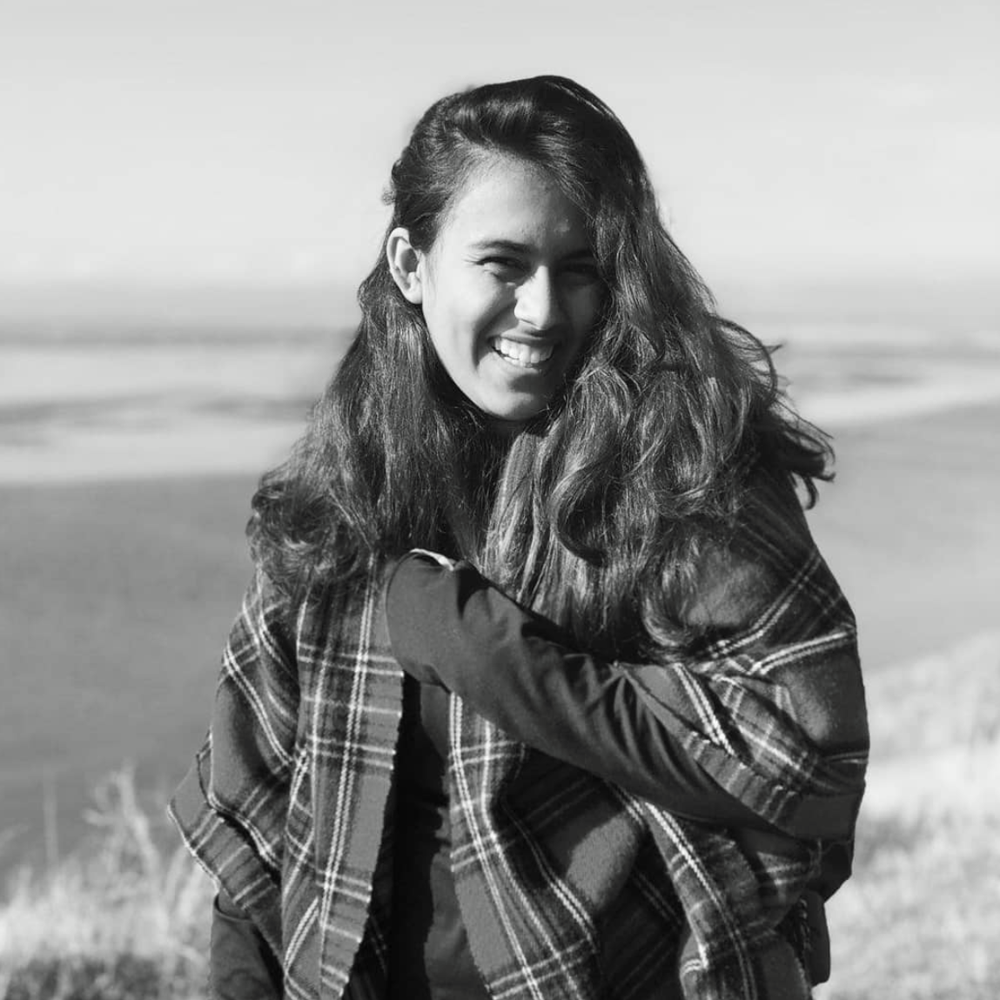
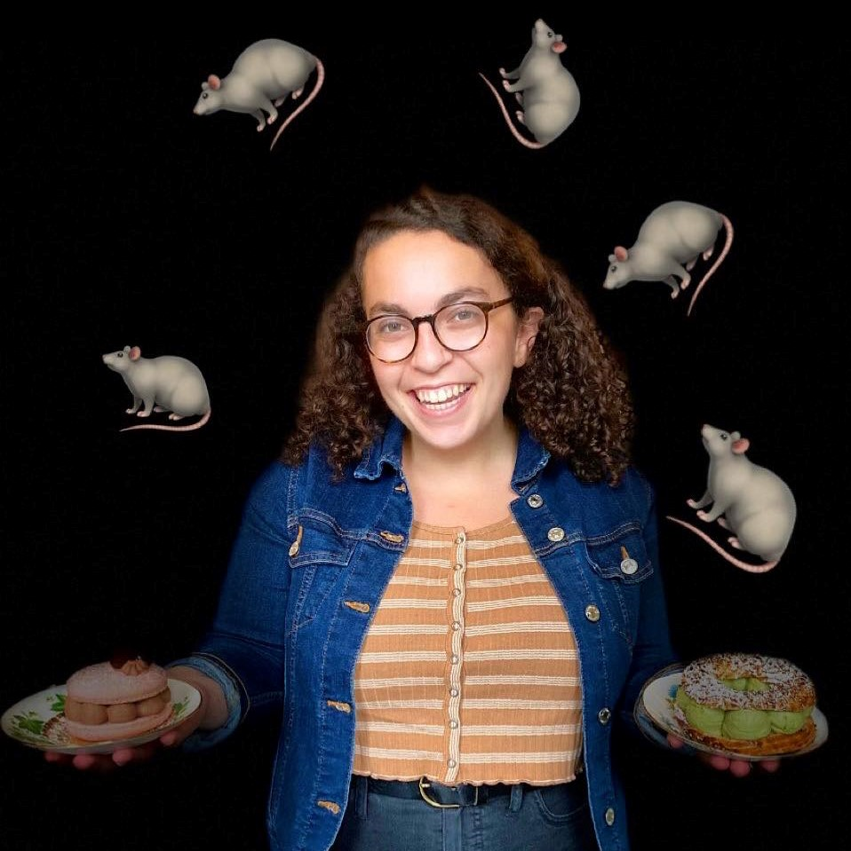
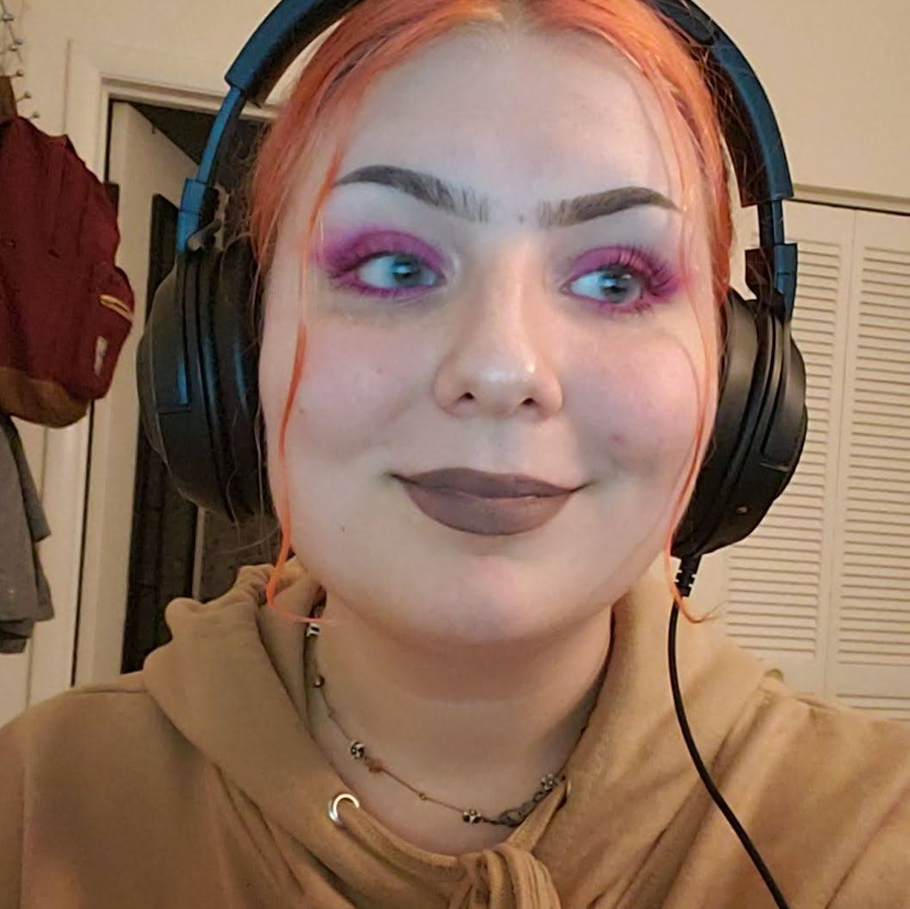

### Project Presentation

### Commercial Screencast

### Writing Assignments & Final Report  
[Writing Assignment 1 - Becky](/res/pdfs/WA1/becky_wa1.pdf)  
[Writing Assignment 1 - Tuhina](/res/pdfs/WA1/tuhina_wa1.pdf)  
[Writing Assignment 1 - Lily](/res/pdfs/WA1/lily_wa1.pdf)  

[Writing Assignment 2](/res/pdfs/WA2/writing-2.pdf)  

[Writing Assignment 3](/res/pdfs/WA3/writing-3.pdf)  

[Final Report](/res/pdfs/final_report.pdf)  

### About us
  
Tuhina is excited to be graduating with a BS in Computer Science and a minor in Bioinformatics. She is looking forward to using her skills in real world development and is grateful for her experience at GW.  

  
Lily is a senior majoring in computer science at the George Washington University. Her passions include making charcuterie boards and going on long walks. She hopes to be able to successfully heely across the national mall one day!  

  
Becky is incredibly excited to be ending her academic career. Instead of paying an institution $280,000 to code, she is going to Seattle after graduation to be paid to code. She hopes that in her future she can foster elderly cats, take bartending classes, and go to lots of concerts. 

